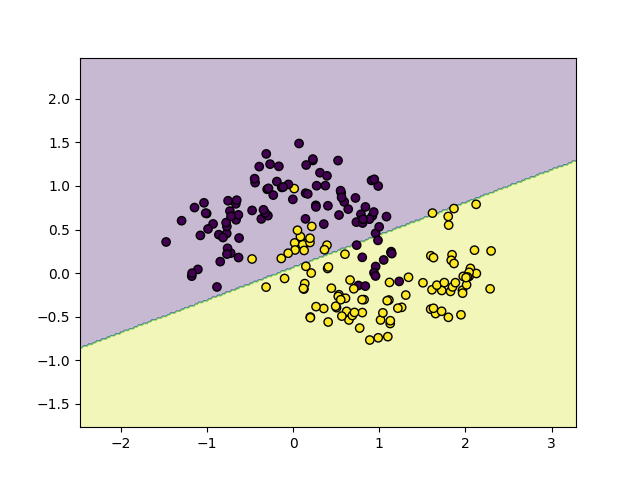

# ML Lab

Personal machine learning laboratory for learning machine learning from scratch.

---

# SVM Decision Boundary Experiment

This project compares:

- Perceptron
- Linear SVM
- RBF Kernel SVM

on nonlinear datasets.

---

# Dataset

We use the moon dataset generated by sklearn:

```python
make_moons()
```

The dataset is nonlinear and suitable for testing kernel methods.

---

# Models

## 1. Perceptron

A basic linear classifier.

Decision function:

w^T x + b

---

## 2. Linear SVM

Linear Support Vector Machine with maximum margin.

---

## 3. RBF Kernel SVM

Nonlinear SVM using RBF kernel.

Kernel function:

K(x, x') = exp(-gamma ||x - x'||²)

---

# Results

## Perceptron



Observation:
- Cannot handle nonlinear dataset well.

---

## Linear SVM


Observation:
- More stable than perceptron
- Still limited by linear boundary

---

## RBF Kernel SVM


Observation:
- Successfully learns nonlinear boundary
- Stronger expressive power

---

# Key Learnings

- Linear models struggle on nonlinear data
- SVM improves generalization through margin maximization
- Kernel trick enables nonlinear classification

---

# Installation

```bash
pip install -r requirements.txt
```

---

# Run

```bash
python src/svm/main.py
```